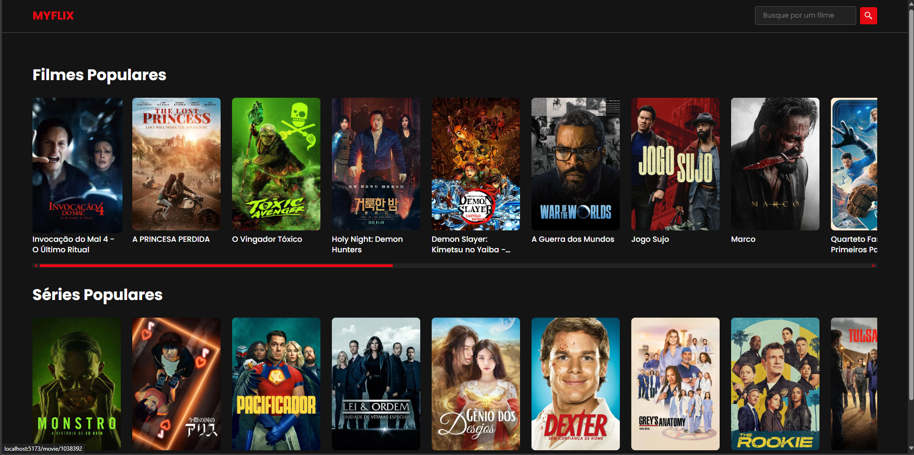

# MyFlix 🎬


Um catálogo de filmes e séries moderno e responsivo, inspirado na Netflix, construído com React e consumindo dados da API do The Movie Database (TMDB).

**[➡️ Acesse a demonstração ao vivo aqui!](https://seu-link-aqui.com)**

---

## 📸 Prévia da Aplicação



---

## 🚀 Sobre o Projeto

O MeuFlix é uma aplicação de front-end desenvolvida como um projeto de estudo para praticar e aprofundar conhecimentos em React.js e seu ecossistema. A plataforma permite aos utilizadores navegar por listas de filmes e séries populares, pesquisar por títulos específicos e ver detalhes completos, incluindo sinopse, avaliação e trailer.

### ✨ Funcionalidades

-   **Página Inicial Dinâmica:** Exibe prateleiras horizontais com os filmes e séries mais populares.
-   **Busca de Títulos:** Barra de pesquisa no cabeçalho para encontrar filmes por nome.
-   **Páginas de Detalhes:** Páginas dedicadas para cada filme e série, com informações detalhadas como sinopse, avaliação, géneros e mais.
-   **Leitor de Trailer:** Funcionalidade de pop-up (Modal) para assistir ao trailer oficial do YouTube diretamente na aplicação.
-   **Navegação Fluida:** Utiliza React Router para uma experiência de navegação rápida e sem recarregamentos de página (SPA).
-   **Design Responsivo:** Interface adaptada para uma boa experiência em desktops, tablets e telemóveis.

---

## 🛠️ Tecnologias Utilizadas

Este projeto foi construído utilizando as seguintes tecnologias e ferramentas:

-   **React.js:** Biblioteca principal para a construção da interface.
-   **Vite:** Ambiente de desenvolvimento rápido e moderno para projetos de front-end.
-   **React Router DOM:** Para a implementação de rotas e navegação.
-   **CSS Modules:** Para estilização de componentes de forma isolada e organizada.
-   **React Icons:** Para a utilização de ícones SVG de forma simples.
-   **React Modal & React YouTube:** Bibliotecas para a criação do pop-up do trailer.
-   **The Movie Database (TMDB) API:** Como fonte de dados para todos os filmes e séries.

---

## ⚙️ Como Executar o Projeto Localmente

Para executar este projeto no seu ambiente local, siga os passos abaixo:

1.  **Clone o repositório:**
    ```bash
    git clone [https://github.com/KaduSR/Myflix.git](https://github.com/KaduSR/Myflix.git)
    ```

2.  **Navegue para a pasta do projeto:**
    ```bash
    cd Myflix
    ```

3.  **Instale as dependências:**
    ```bash
    npm install
    ```

4.  **Configure as Variáveis de Ambiente:**
    -   Crie um ficheiro chamado `.env` na raiz do projeto.
    -   Dentro dele, adicione a sua chave de API do TMDB, como no exemplo abaixo:
        ```
        VITE_API_KEY=suaChaveDaApiAqui
        ```

5.  **Inicie o servidor de desenvolvimento:**
    ```bash
    npm run dev
    ```

6.  Abra o seu navegador e aceda a `http://localhost:5173` (ou o endereço que aparecer no seu terminal).

---

## ✒️ Autor

Feito com ❤️ por **Kadu Ribeiro**

-   LinkedIn: [@kaduesr](https://www.linkedin.com/in/kaduesr/)
-   GitHub: [@KaduSR](https://github.com/KaduSR)
